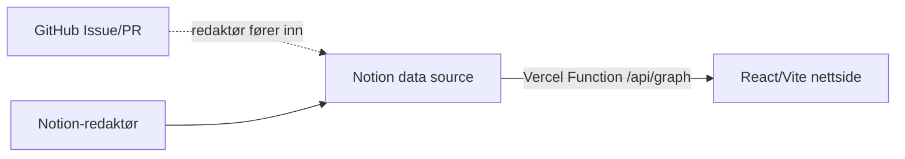

# overvaking.iverfinne.no

Repo for [overvaking.iverfinne.no](https://overvaking.iverfinne.no/).

Den deploya appen ligg i `overvakingskartet/`. Vercel skal ha Root Directory sett til `overvakingskartet`.

## Flyt

Notion er kjeldesanninga. Nettsida les berre `/api/graph`, og dette endepunktet hentar tekstblokker, nodar, kantar, lag, fargar og filternamn direkte frå Notion. Det finst ikkje runtime-fallback til `graph.json`.



## Lokal køyring

```bash
cd overvakingskartet
npm i
npm run dev
```

`npm run dev` startar Vite på port `5173`. Sidan appen ikkje har statisk data-fallback, må `/api/graph` kome frå Vercel Function for at nodar skal visast. Viss Notion-env manglar i Vercel, skal appen vise feil i staden for gamle data.

## Vercel-miljøvariablar

Legg desse i Vercel Project Settings:

- `NOTION_TOKEN`
- `NOTION_DATA_SOURCE_ID` eller `NOTION_DB_ID`
- `NOTION_CONTENT_PAGE_ID` dersom intro/essay ligg som eiga Notion-side

Del Notion-datakjelda med integrasjonen `overvaking.iverfinne.no`.
