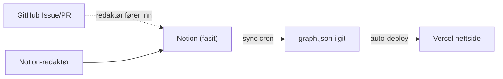

# overvaking.iverfinne.no

Open data-kart over overvakingsinfrastruktur i Noreg.

## Flyt

Notion er kjeldesanninga. GitHub Actions synkar databasen til `data/graph.json`, og nettsida les berre denne fila.



## Datakontrakt

`data/graph.json` er einaste grensesnitt mellom Notion-synken og frontend.

```ts
export type GraphNode = {
  id: string
  label: string
  type: string
  lag?: string
  sektor?: string
  orgType?: string
  status?: string
  kategori?: string
  kjeldeUrl?: string
}

export type GraphEdge = {
  id: string
  source: string
  target: string
  relasjonstype: string
  mekanisme?: string
  tilgangsniva?: number
  praksis?: string
}

export type Graph = { nodes: GraphNode[]; edges: GraphEdge[] }
```

## Lokal køyring

```bash
npm i
npm run dev
```

## Synk frå Notion

1. Regenerer Notion-tokenet dersom det nokon gong har vore delt utanfor GitHub secrets.
2. Legg inn desse GitHub Actions-secrets i repoet:
   - `NOTION_TOKEN`
   - `NOTION_DB_ID`
3. Del Notion-databasen med integrasjonen `overvaking.iverfinne.no`.
4. Køyr `Actions → sync-notion → Run workflow`.

Manuelt lokalt:

```bash
NOTION_TOKEN=... NOTION_DB_ID=... npm run sync:notion
```

## Bidrag

Dataforslag kjem inn som GitHub Issues. Godkjende forslag blir førte inn i Notion, og synken oppdaterer grafen.
