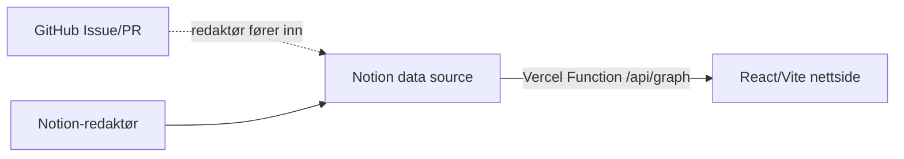

# overvaking.iverfinne.no

Open data-kart over overvakingsinfrastruktur i Noreg.

## Flyt

Notion er kjeldesanninga. Nettsida les berre `/api/graph`, og dette endepunktet hentar tekstblokker, nodar, kantar, lag, fargar og filternamn direkte frå Notion. Det finst ikkje runtime-fallback til `graph.json`.



## Notion-innhald

Same Notion-kjelde kan styre både teksten og grafen.

Tekstrader kan ha `Type` lik `Tekst`, `Essay`, `Intro`, `Avsnitt`, `Sitat`, `Punkt` eller `Overskrift`. Bruk gjerne eigenskapane `Seksjon`, `Variant`, `Tekst`, `Lenkje`, `Lenketekst` og `Rekkefølgje`.

Graf-rader brukar `Type` for entity-typane `System`, `Organisasjon`, `Lovheimel`, `Tilsyn`, `Sak` og `Person`, og edge-typane `Tilgang` og `Datadeling`.

## Datakontrakt

`/api/graph` returnerer:

```ts
export type Graph = {
  meta?: {
    kjelde?: string
    nodar?: number
    kantar?: number
    lagFargar?: Record<string, string>
  }
  content?: {
    blocks: ContentBlock[]
  }
  nodes: GraphNode[]
  edges: GraphEdge[]
}
```

## Lokal køyring

```bash
npm i
npm run dev
```

`npm run dev` startar Vite på port `5173`. Sidan appen ikkje har statisk data-fallback, må `/api/graph` kome frå Vercel Function for at nodar skal visast. Viss Notion-env manglar i Vercel, skal appen vise feil i staden for gamle data.

## Vercel-miljøvariablar

Legg desse i Vercel Project Settings:

- `NOTION_TOKEN`
- `NOTION_DATA_SOURCE_ID` eller `NOTION_DB_ID`
- `NOTION_CONTENT_PAGE_ID` dersom intro/essay ligg som eiga Notion-side

Del Notion-datakjelda med integrasjonen `overvaking.iverfinne.no`.

## Bidrag

Dataforslag kjem inn som GitHub Issues. Godkjende forslag blir førte inn i Notion, og nettsida hentar dei frå Notion på neste kall til `/api/graph`.
